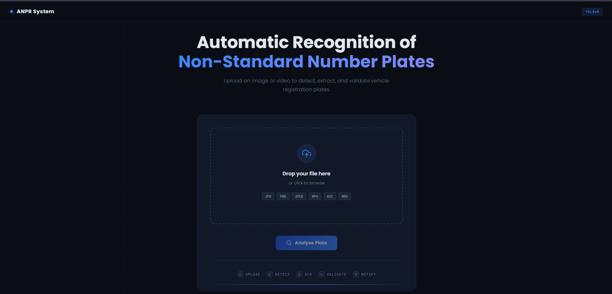
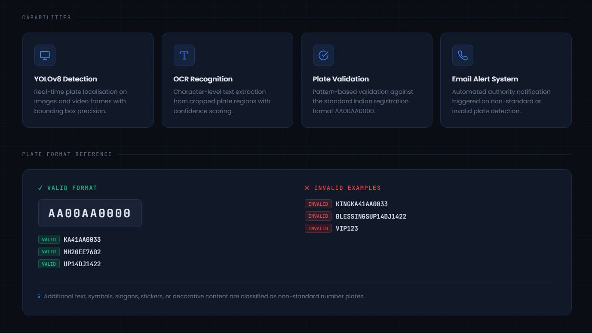
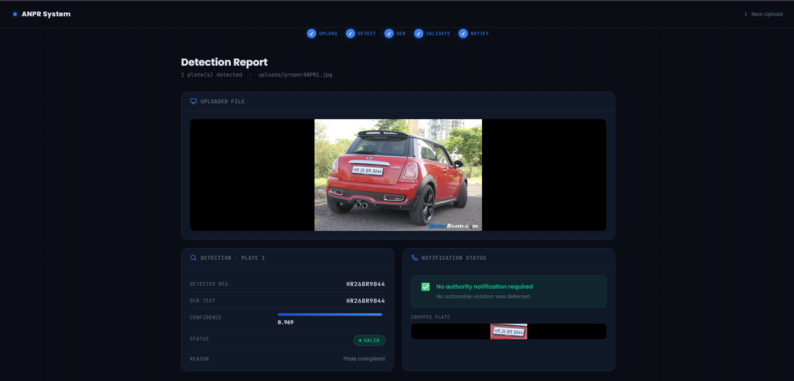
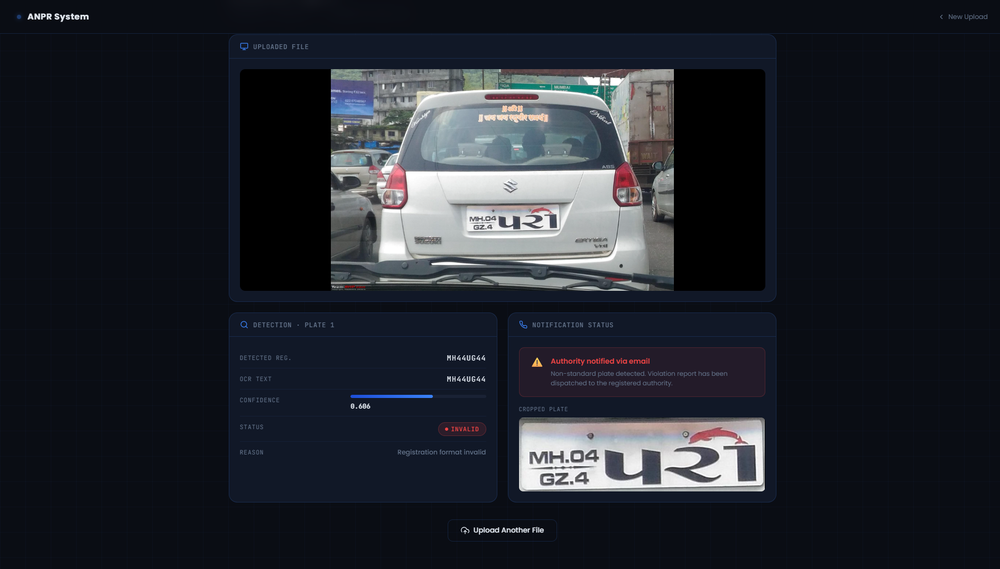
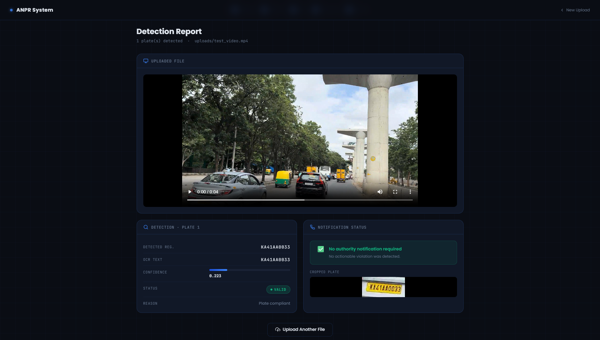

# Automatic Recognition of Non-Standard Number Plates Using YOLOv8

## Overview

This project presents an AI-powered Automatic Number Plate Recognition (ANPR) system capable of detecting and validating vehicle registration plates from images and videos.

The system identifies non-standard number plates containing unauthorized text, decorative content, slogans, or modified registration formats and automatically notifies the concerned authority through email.

## Features

* Vehicle number plate detection using YOLOv8
* Optical Character Recognition (OCR) using EasyOCR
* Indian registration format validation
* Detection of non-standard number plates
* Image and video support
* Automatic email notification for violations
* User-friendly web interface using Flask

## Technology Stack

* Python
* Flask
* YOLOv8
* EasyOCR
* OpenCV
* PyTorch

## Installation

```bash
pip install -r requirements.txt
```

## Environment Variables

Create a `.env` file:

EMAIL_ADDRESS=[your_email@gmail.com](mailto:your_email@gmail.com)

EMAIL_PASSWORD=your_app_password

## Run

```bash
python app.py
```

## Valid Registration Format

AA00AA0000

Examples:

* KA41AA0033
* MH20EE7602
* UP14DJ1422

## Project Objective

To automatically identify non-standard vehicle registration plates and assist authorities in enforcing compliance with registration regulations.

## Screenshots

### Home Page



### Valid Plate Detection


### Invalid Plate Detection


### Video Detection



